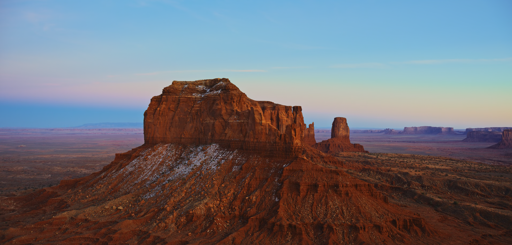
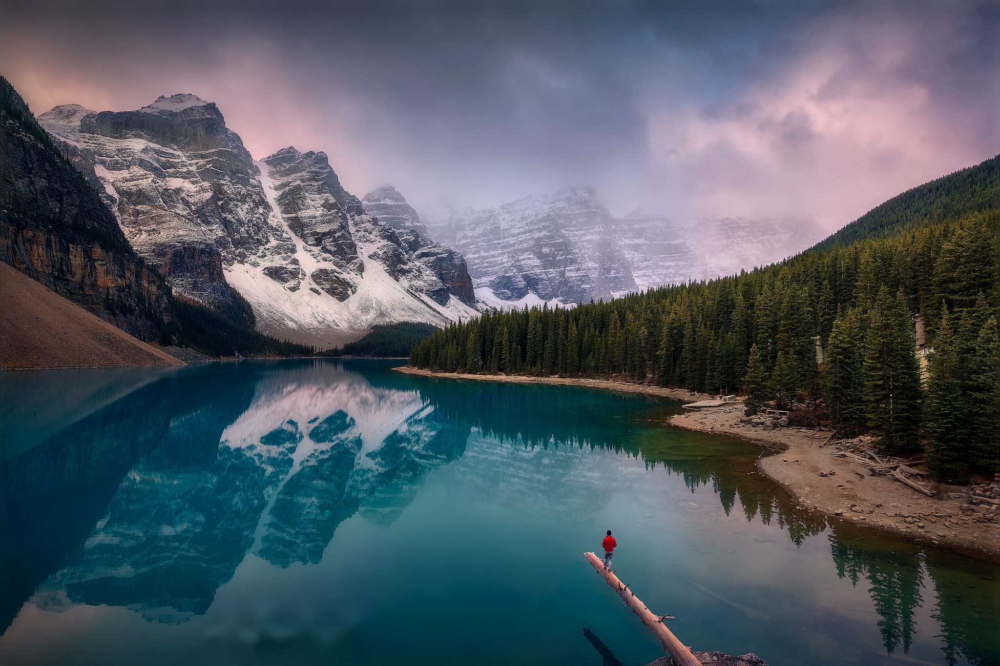
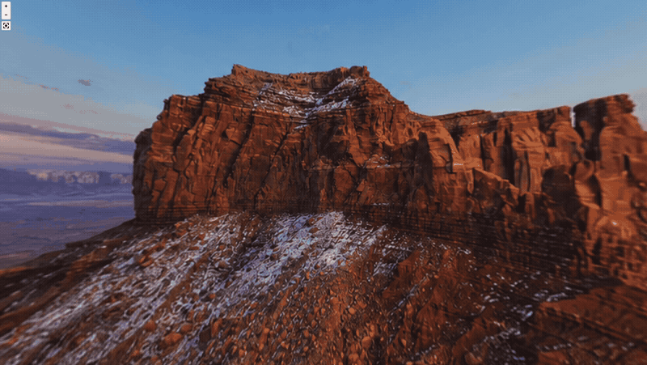
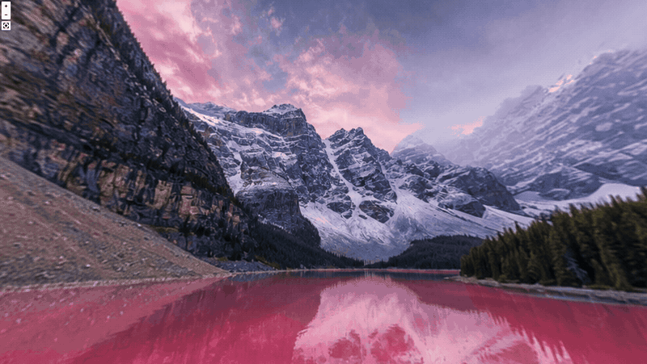

# SceneMakerAI

**Turn any 2D image into a world you can look around in.**

Give Codex an image, describe how you want the world to feel, and get back an **interactive 360 preview**.

Start with any scene. Then **ITERATE** with plain-English edits: add UFOs, turn a lake pink, or change the mood.

**No 3D modeling. No scene setup. Just image in, world out, preview live.**

## Install

You do not need to install the `skills` CLI first if you have Node.js installed. `npx` will fetch and run it for you:

```bash
npx skills add ojassurana/SceneMakerAI --skill scenemakerai
```

Install globally instead of project-local:

```bash
npx skills add ojassurana/SceneMakerAI --skill scenemakerai --global
```

Install for every detected agent:

```bash
npx skills add ojassurana/SceneMakerAI --skill scenemakerai --all
```

Check that the skill is visible:

```bash
npx skills list
```

If `npx` is not available, install Node.js first from [nodejs.org](https://nodejs.org/) or with your system package manager.

## Examples

<table>
  <tr>
    <th width="50%">Desert Mesa</th>
    <th width="50%">Moraine Lake</th>
  </tr>
  <tr>
    <td width="50%">
      
    </td>
    <td width="50%">
      
    </td>
  </tr>
  <tr>
    <td width="50%">
      <strong>Prompt</strong><br>
      <code>Make a 3D world for this image. <strong>Add 2 big ufos in the appropriate places.</strong></code>
    </td>
    <td width="50%">
      <strong>Prompt</strong><br>
      <code>Make a 3D world for this image. <strong>Make it a pink lake instead.</strong></code>
    </td>
  </tr>
  <tr>
    <td width="50%"></td>
    <td width="50%"></td>
  </tr>
</table>

## What It Does

- Turns one image into an interactive 360-style world.
- Lets you describe edits in plain language.
- Supports follow-up iterations after the first preview.
- Automatically hosts a local preview URL.
- Refreshes the preview with cache-busted URLs so edits show up promptly.

## What It Does Not Do

- It does not create walkable 3D geometry.
- It does not output cubemap faces.
- It does not treat generated unseen areas as factual reconstruction.

## Technical Output

SceneMakerAI generates one wide `2:1` equirectangular panorama image and previews it with Pannellum.

The final image is saved under the agent's current working directory:

```text
outputs/scenemakerai/<run-id>/panorama.png
```

## Skill Layout

```text
SKILL.md
agents/openai.yaml
references/prompting.md
scripts/prepare_pano_canvas.py
scripts/create_pannellum_viewer.py
```

`SKILL.md` is the main Codex skill file. The scripts handle deterministic canvas preparation and Pannellum viewer generation.

## Basic Use

Ask Codex to use the skill with an image:

```text
Use SceneMakerAI for this image. Add a few helium airships around the skyline.
```

The expected final response includes:

- the saved panorama path
- the local Pannellum preview URL

## Preview Behavior

The viewer helper copies the panorama into the viewer with a content-hashed filename and returns a cache-busted URL, for example:

```text
http://localhost:8000/?v=714c78f44b70
```

This avoids stale browser or Pannellum cache after edits.
